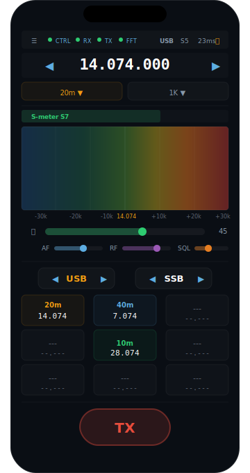
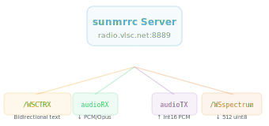
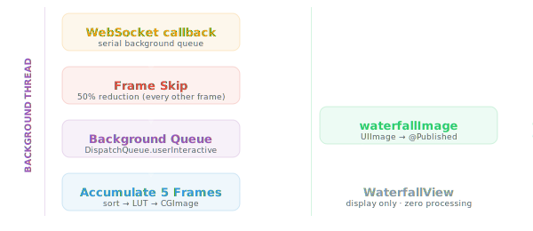

# SunsdrMobile

**Native iOS app for SunSDR2 DX amateur radio transceiver control.**

Control your SunSDR2 DX radio from iPhone with real-time spectrum waterfall, audio playback, DSP processing, and full QSO management — a complete mobile replacement for the web frontend.

🌐 **[Project Website](https://cheenle.github.io/SunsdrMobile/)** — promotional page with feature overview, architecture, and quick-start guide.


---

## Features

### Spectrum & Waterfall
- Real-time 512-bin FFT waterfall with web-matching colour ramp
- Adaptive noise floor (30th percentile + headroom)
- Contrast stretching with configurable gain/bias
- Dynamic frequency scale that adjusts to IQ sample rate (39k/78k/156k/312k)
- Tap-to-tune on waterfall

### Audio
- RX: PCM Int16 48kHz audio playback via AVAudioPlayerNode
- TX: Microphone capture → downsample (48k→16k) → Int16 PCM → WebSocket
- Audio level meter with RMS display
- Mute toggle

### Controls
- **Frequency**: Large 56pt display, step up/down (1K/5K/10K/50K/100K), tap-to-enter
- **Band**: 12 presets (160m–2m) via Picker menu
- **Mode**: USB/LSB/CW/AM/FM/WFM rotary selector
- **Filter**: CW/SSB/Wide/AM/FM bandwidth presets
- **Gain**: AF, RF, and Squelch sliders
- **PTT**: Large 96pt button with long-press gesture and TX level indicator

### DSP Panel
- WDSP master enable/disable
- NR2 noise reduction with level control
- NB (Noise Blanker), ANF (Automatic Notch Filter), NF
- AGC modes: Off / Slow / Medium / Fast
- Manual notch list with add/delete

### Channel Memory
- 3×3 grid of frequency presets (always visible, 9 slots)
- Tap any cell to instantly tune frequency + mode
- Empty slots show placeholder, ready for quick-save
- Persisted via UserDefaults JSON

### Settings
- Favorites list with swipe-to-delete
- Server host configuration
- IQ sample rate selector (39k / 78k / 156k / 312k)
- Connection status indicators
- AF gain slider

---

## Screenshots




---

## Requirements

| Component | Requirement |
|-----------|-------------|
| iOS | 17.0+ |
| Xcode | 15.0+ |
| Swift | 5.9 |
| Device | Physical iPhone (simulator lacks full AVAudioEngine mic support) |
| Backend | SunSDR2 DX running `sunmrrc` FastAPI server |

---

## Quick Start

### 1. Clone

```bash
git clone https://github.com/cheenle/SunsdrMobile.git
cd SunsdrMobile
```

### 2. Generate Xcode Project

```bash
xcodegen generate
```

### 3. Open & Build

```bash
open SunsdrMobile.xcodeproj
```

Select your iPhone as the target, configure signing (Team: `VQ89MM7935`), then `Cmd+R`.

### 4. Login

Enter your server address (default: `radio.vlsc.net:8889`) and password on the login screen. Credentials are stored in Keychain for auto-login.

---

## Project Structure

```
SunsdrMobile/
├── project.yml                     # XcodeGen spec
├── CLAUDE.md                       # Developer reference
├── README.md
├── Resources/
│   └── Info.plist
└── Sources/
    ├── App/
    │   └── SunsdrMobileApp.swift        # @main entry, auto-login
    ├── Model/
    │   ├── RadioState.swift              # @Published central state
    │   └── FavoritesManager.swift        # Channel presets
    ├── Networking/
    │   ├── WebSocketConnection.swift     # URLSessionWebSocketTask
    │   └── ConnectionManager.swift       # 4-socket manager
    ├── ViewModel/
    │   └── RadioViewModel.swift          # Central coordinator
    ├── Audio/
    │   ├── AudioPlaybackManager.swift    # RX playback
    │   ├── AudioCaptureManager.swift     # TX capture
    │   └── SpectrumProcessor.swift       # Waterfall rendering
    └── UI/
        ├── ContentView.swift
        ├── HeaderView.swift              # Freq + band + status
        ├── MainRXView.swift              # RX tab
        ├── WaterfallView.swift           # Spectrum display
        ├── FrequencyDisplay.swift        # 56pt digits
        ├── SMeterView.swift
        ├── ModeSelectorView.swift
        ├── PTTButtonView.swift           # 96pt TX button
        ├── DSPPanelView.swift
        ├── SettingsView.swift
        └── LoginView.swift
```

---

## Architecture

### Data Flow



### Spectrum Pipeline (CPU-optimized)



All heavy computation runs off the main thread. WaterfallView is a pure display view — no `onChange`, no processing logic.

### State Management

`RadioState` (~30 `@Published` properties) → `RadioViewModel` (forwards `objectWillChange`) → SwiftUI views via `@EnvironmentObject`

Server text messages are parsed in `RadioState.apply(serverMessage:)` using `cmd:val` protocol.

---

## Backend Compatibility

This app is designed to work with the `sunmrrc` FastAPI server from the [sunsdrv2](https://github.com/cheenle/sunsdrv2) project.

**Required server version**: sunmrrc v3.4+

**Authentication**: POST `/api/auth/login` → `sunmrrc_auth` cookie → `?token=` WebSocket query param

---

## Build (Command Line)

```bash
# Generate project
xcodegen generate

# Build for device (unsigned)
xcodebuild -project SunsdrMobile.xcodeproj \
  -scheme SunsdrMobile \
  -sdk iphoneos \
  -destination 'generic/platform=iOS' \
  CODE_SIGN_IDENTITY="" CODE_SIGNING_REQUIRED=NO \
  build
```

---

## License

MIT

---

🤖 Built with [Claude Code](https://claude.ai/code)
