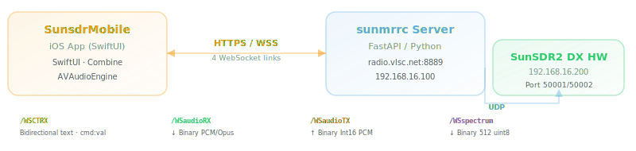
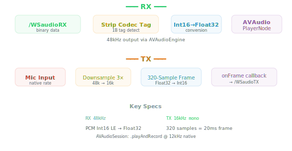

# SunsdrMobile — Architecture Overview

## System Context

SunsdrMobile is a native iOS (SwiftUI) frontend for the SunSDR2 DX amateur radio transceiver. It communicates with the `sunmrrc` Python FastAPI backend over HTTPS/WebSocket, providing full radio control, real-time audio, spectrum waterfall, and DSP management.



## Data Flow

### WebSocket Endpoints

| Endpoint | Direction | Protocol | Payload |
|----------|-----------|----------|---------|
| `/WSCTRX` | Bidirectional | Text `cmd:val` | freq, mode, PTT, DSP, AGC, ping |
| `/WSaudioRX` | Server → Client | Binary | 1B codec tag + Int16 PCM / Opus |
| `/WSaudioTX` | Client → Server | Binary | Int16 PCM (16kHz mono) |
| `/WSspectrum` | Server → Client | Binary | 512 × uint8 dB (0=‑120dB, 255=0dB) |

### Control Flow


### Spectrum Flow (CPU-Optimized)


Key: all heavy computation stays off the main thread. Only the final UIImage crosses to MainActor.

### Audio Flow



## Component Model

### State: `RadioState` (`@MainActor`, `@ObservableObject`)

Central state model with ~30 `@Published` properties organized by concern:

- **Frequency**: `frequency: Int` (Hz), `mode: String`
- **Signal**: `signalLevel: Int` (S0–S9+), `latency: String`
- **Audio**: `afGain`, `rfGain`, `squelch` (all 0.0–1.0)
- **Connection**: `ctrlConnected`, `audioRXConnected`, `audioTXConnected`, `spectrumConnected`, `connectionError`
- **PTT**: `ptt: Bool`, `powerOn: Bool`
- **DSP**: `wdspEnabled`, `nr2Enabled`, `nr2Level`, `nbEnabled`, `anfEnabled`, `nfEnabled`, `agcMode`, `filterLow`, `filterHigh`, `notches: [WDSPNotch]`
- **Spectrum**: `spectrumData: Data?`, `waterfallImage: UIImage?`, `iqSampleRateHz: Int`

Static data: `bands` (12 presets), `sampleRateMapping` (4 IQ rates), `sampleRateOptions` (menu labels).

Server message parsing: `apply(serverMessage:)` handles `cmd:val` protocol with ~15 command cases.

### ViewModel: `RadioViewModel` (`@MainActor`, `@ObservableObject`)

Central coordinator. Owns all sub-managers:

| Property | Type | Role |
|----------|------|------|
| `state` | `RadioState` | Central @Published state |
| `connection` | `ConnectionManager` | 4-socket WS management |
| `audioPlayback` | `AudioPlaybackManager` | RX audio output |
| `audioCapture` | `AudioCaptureManager` | TX microphone input |
| `favorites` | `FavoritesManager` | Channel presets |
| `spectrumProc` | `SpectrumProcessor` | Waterfall rendering |

Key methods:
- `powerOnAsync()` — POST login → extract auth token → connect all sockets
- `bindSockets()` — wire WS callbacks to audio/spectrum/state
- `setFrequency()`, `setMode()`, `setPTT()`, `setFilter()`, DSP setters
- `setIQSampleRate()` — sends `setSampleRate:39k|78k|...` to server

### SpectrumProcessor

Thread-safe waterfall renderer. Operates entirely on its own serial dispatch queue (`.userInteractive`):

1. **Frame skip**: `skipCounter & 1 == 0` → drops 50% of incoming frames
2. **Dispatch**: `queue.async` serializes work
3. **Accumulation**: 512 × `Float(UInt8)` conversion per frame, sum into `accum[512]`
4. **Trigger**: when `accumCount >= wfDecimate` (5) AND ≥100ms since last draw
5. **Processing**:
   - Normalize: multiply accumulator by `1/count`
   - Noise floor: sort 512 values, take 30th percentile + 2 headroom
   - LUT: contrast stretch `v = bias + (value - floor) * gain`, clamp 0–255, lookup colour
   - Scroll: `memmove` 100-row pixel buffer by 1 row
   - Render: `CGImage` → `UIImage` via `CGDataProvider`
6. **Publish**: `DispatchQueue.main.async { state.waterfallImage = img }`

Parameters (match `controls.js` `_wfBuildColorLUT()`):
```
wfDecimate=5, wfPctl=0.30, wfHeadroom=2
wfGain=8.0, wfBias=52
```

### AudioPlaybackManager

RX audio chain. Key characteristics:

- **Format detection**: reads 1-byte codec tag; `0x00`=PCM, `0x01`=Opus (skipped)
- **Conversion**: Int16 LE → Float32 via manual byte assembly (`UInt16(lo) | UInt16(hi)<<8`)
- **Sample rate**: 48000 Hz (matches server `RX_OUT_RATE`)
- **Buffer**: per-frame `AVAudioPCMBuffer` allocation, scheduled on `ioQueue`
- **Meter**: RMS computed per frame, published via `@Published rmsLevel`
- **Recording**: optional Float32 sample capture, export as WAV

### AudioCaptureManager

TX microphone chain:

- **Session**: `.playAndRecord` category with Bluetooth HFP + defaultToSpeaker
- **Tap**: `AVAudioInputNode.installTap` at native rate (typically 48kHz)
- **Downsample**: integer factor `nativeRate / 16000` (typically 3×)
- **Frame**: accumulates 320 samples (= 20ms @ 16kHz), converts to Int16 LE
- **Output**: `onFrame` callback → `/WSaudioTX` WebSocket

### ConnectionManager & WebSocketConnection

`ConnectionManager` manages 4 `WebSocketConnection` instances:

| Property | Endpoint | Type |
|----------|----------|------|
| `ctrl` | `/WSCTRX` | Text |
| `audioRX` | `/WSaudioRX` | Binary |
| `audioTX` | `/WSaudioTX` | Binary |
| `spectrum` | `/WSspectrum` | Binary |

Each `WebSocketConnection`:
- Wraps `URLSessionWebSocketTask` with autoreconnect
- Auth: appends `?token=` query parameter
- Reconnect: 3-second delay, stops on 4001 (auth failure)
- Receive: chained `task.receive { }` pattern (no busy-looping)

## UI Layout

### Screen Hierarchy

```
SunsdrMobileApp
  └─ ContentView
       ├─ [off] StartupPrompt (antenna icon + "连接电台")
       └─ [on]  VStack
                 ├─ HeaderView
                 │   ├─ Row 1: ☰ + status dots + mode + signal + latency + ⏻
                 │   ├─ Row 2: [◀] FrequencyDisplay [▶]
                 │   └─ Row 3: [Band▼] + [Step▼]
                 └─ TabView
                      ├─ MainRXView (RX tab)
                      │   ├─ SMeterView
                      │   ├─ WaterfallView (120pt)
                      │   ├─ Audio level bar + mute
                      │   ├─ AF/RF/SQL GainSliders
                      │   ├─ Divider
                      │   ├─ ModeSelector + FilterSelector (one row)
                      │   ├─ 3×3 FavoritesGrid
                      │   ├─ Divider
                      │   └─ PTTButtonView (96pt)
                      ├─ DSPPanelView (DSP tab)
                      │   ├─ WDSP toggle + recording
                      │   ├─ NotchChartView
                      │   ├─ NR2 card (enable + level + meter)
                      │   ├─ NB/ANF/NF toggles
                      │   ├─ AGC button group (关/慢/中/快)
                      │   └─ Notch list (add/delete)
                      └─ SettingsView (设置 tab)
                          ├─ Quick-save current frequency
                          ├─ Favorites list
                          ├─ Server config + reconnect
                          ├─ Connection status
                          ├─ AF gain + IQ sample rate
                          ├─ Clear favorites
                          └─ About section
```

### Key UI Components

**FrequencyDisplayView**: 8-digit monospaced display at 56pt bold. Format: `XX.XXX.XXX` (e.g., `14.074.000`). Tappable for keyboard input in kHz.

**WaterfallView**: Pure display — receives pre-rendered `UIImage?` from state. Zero processing logic. Overlay: dynamic frequency labels based on IQ bandwidth. Supports tap-to-tune gesture.

**PTTButtonView**: 96pt red circle with long-press gesture. `onPressingChanged` prevents rapid cycling. TX level indicator bar shown during transmission.

**FavoritesGrid**: 3×3 `LazyVGrid` showing first 9 `ChannelPreset` entries. Each cell: name + frequency. Empty slots: grey `---` placeholder. Tap tunes frequency + mode instantly.

**SettingsView**: `List` with `.insetGrouped` style, custom `StatusLine` rows with green/red dots.

## Performance

### CPU Optimizations

| Optimization | Impact |
|-------------|--------|
| SpectrumProcessor on background queue | Zero main-thread spectrum work |
| Frame skip (50%) before dispatch | Halves dispatch overhead |
| 5-frame accumulation | 5× less waterfall row processing |
| 10fps waterfall throttle | Max 10 UIImage updates/sec |
| WaterfallView no processing | No `onChange`, no body re-eval on spectrum data |
| Audio: no `Task { @MainActor }` per frame | Eliminates Task creation overhead |
| Audio: original byte conversion | Known-safe, no buffer reuse races |

### Memory

- Waterfall pixel buffer: 512 × 100 × 4 = 200 KB
- Spectrum accumulator: 512 × 4 = 2 KB
- Audio: per-frame Float32 + Int16 buffers (~1–4 KB each, released per frame)

## Dependencies

**Zero external dependencies** — no CocoaPods, SPM, or Carthage. Pure Apple frameworks:

- SwiftUI + Combine
- AVFoundation (AVAudioEngine, AVAudioPlayerNode)
- Foundation (URLSessionWebSocketTask, UserDefaults, Keychain)
- UIKit (UIGraphicsImageRenderer, UIImage, CGImage)

## Build Configuration

- **project.yml**: XcodeGen spec, generates `.xcodeproj`
- **Deployment target**: iOS 17.0
- **Swift**: 5.9
- **Bundle ID**: `com.hamradio.sunsdrmobile`
- **Team**: VQ89MM7935
- **Signing**: Automatic
