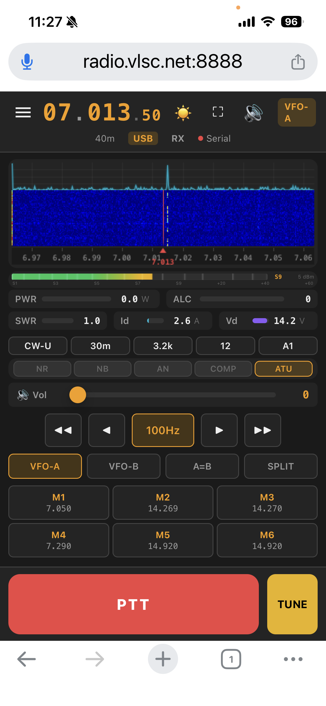

# FT-710 Web Control

Web-based remote control server for the [Yaesu FT-710](https://www.yaesu.com/) HF/50MHz transceiver. Full browser-based control from any modern device — bidirectional audio (RX/TX) with Opus compression, real-time FFT spectrum plot + waterfall, S-meter, frequency/mode/filter control, multi-meter telemetry (PWR/ALC/SWR/Id/Vd), PTT management, and memory channels. Mobile-first responsive UI optimized for iPhone/iOS Safari.



## Quick Start

### macOS / Linux

```bash
cd mrrc_ft710
pip install -r requirements.txt

# macOS (FT-710 Enhanced COM Port):
FT710_SERIAL_PORT=/dev/cu.usbserial-0121DB3A0 python3 server.py

# Linux:
FT710_SERIAL_PORT=/dev/ttyUSB0 python3 server.py
```

Open `http://localhost:8888` in a browser. **Default password: change it immediately** — see [SECURITY_GUIDE.md](SECURITY_GUIDE.md).

### Windows Desktop Installer

Windows 11/12 users can install the desktop package — no Python install
required. The installer runs a user-launched desktop app with an embedded
Python runtime; closing the launcher window stops the server.

**Download v1.6.0** (28.3 MB, MD5 `2be2a654242f284f73104aea2e010c41`):

- Fast mirror: <https://www.vlsc.net/mrrc_ft710/downloads/MRRC-FT710-Setup.exe>
- GitHub Releases: <https://github.com/cheenle/mrrc_ft710/releases>

After install, edit `%LOCALAPPDATA%\MRRC-FT710\ft710.env` (Start Menu →
`Edit Configuration`) to set the Enhanced COM Port and web password, then
launch `MRRC FT-710` from the Start Menu. Build and installation details
are in [docs/WINDOWS_INSTALLER_GUIDE.md](docs/WINDOWS_INSTALLER_GUIDE.md).

Key Windows package paths:

```text
packaging\windows\build.ps1
dist\windows\MRRC-FT710-Setup.exe
%LOCALAPPDATA%\MRRC-FT710\ft710.env
```

### Environment Variables

| Variable | Default | Description |
|----------|---------|-------------|
| `FT710_SERIAL_PORT` | `/dev/cu.SLAB_USBtoUART` | CAT serial port (Enhanced COM Port, 38400 baud) |
| `FT710_BAUD_RATE` | `38400` | CAT serial baud rate |
| `FT710_WEB_PORT` | `8888` | Web server port |
| `FT710_WEB_PASSWORD` | `changeme_please_use_strong_password!` | Login password (**must change**) |
| `FT710_WEB_HOST` | `::` | Bind address (IPv6 dual-stack) |
| `FT710_FTDI_LIB_DIR` | *(auto)* | Directory containing FTDI libraries |
| `FT710_FT4222_CLK_DIV` | `6` | SPI clock divider (1=fastest, 9=slowest). Default CLK_DIV_64 matches wfview |
| `FT710_SCOPE_PORT` | *(optional)* | Scope serial port (Standard COM Port, for SCU-LAN10 models) |
| `FT710_SCOPE_BAUD` | `115200` | Scope serial baud rate |
| `FT710_AUDIO_RX_DEVICE` | *(auto)* | Audio input device (index or name substring, e.g. `"FT-710"` or `"3"`) |
| `FT710_AUDIO_TX_DEVICE` | *(auto)* | Audio output device (index or name substring) |
| `FT710_MEM_FILE` | `mem_channels.json` | Memory-channel JSON path; Windows launcher stores this under `%LOCALAPPDATA%` |

### CLI Arguments

| Argument | Default | Description |
|----------|---------|-------------|
| `--port` | `8888` | Web server port |
| `--serial-port` | `/dev/cu.SLAB_USBtoUART` | CAT serial port |
| `--baud` | `38400` | CAT serial baud rate |
| `--password` | *(env default)* | Login password |
| `--host` | `::` | Bind address (IPv6 dual-stack) |
| `--ssl-cert` | `certs/fullchain.pem` | SSL certificate file |
| `--ssl-key` | `certs/radio.vlsc.net.key` | SSL private key file |
| `--no-ssl` | *(flag)* | Disable SSL (plain HTTP) |

## Architecture

```
Browser (iPhone / Desktop / Tablet)
  ↕ HTTP + WebSocket (4 channels: control, audio RX, audio TX, spectrum)
FT-710 Server (Python FastAPI + Uvicorn)
  ├── ↕ Serial CAT (USB Enhanced COM Port, 38400 baud)
  ├── ↕ FT4222 SPI (scope_pipe subprocess → real spectrum data)
  ├── ↕ S-meter fallback (synthetic spectrum when FT4222 unavailable)
  └── ↕ USB Audio (PyAudio capture/playback → Opus codec → browser)
Yaesu FT-710 Radio
```

### WebSocket Endpoints

| Endpoint | Protocol | Description |
|----------|----------|-------------|
| `/WSradio` | JSON text | Control commands, state updates, memory management |
| `/WSaudioRX` | Binary tagged | RX audio: 1-byte codec tag (0x00=PCM, 0x01=Opus 48kHz) + payload |
| `/WSaudioTX` | Binary tagged + text | TX mic uplink: tagged audio frames + text control (`s:` stop, `m:` settings) |
| `/WSspectrum` | Binary | Spectrum frames: v1=851B (1B ver + 850B wf1), v2=1701B (+850B wf2), ~30fps |

### Dual-Mode Spectrum

- **FT4222 SPI mode**: Reads raw 4096-byte scope frames from the FTDI FT4222 chip via platform FTDI libraries (`libft4222.dylib` / `libft4222.so` / `FT4222.dll`). Provides true 850-point FFT spectrum waterfall.
- **S-meter fallback**: When the FT4222 is unavailable, generates a synthetic multi-peak spectrum from CAT S-meter readings — still provides real-time band activity visualization.

### Audio Pipeline

**RX Audio:**
```
FT-710 USB Audio → PyAudio capture (44.1kHz Int16) → Resample 44.1k→48k
  → Opus encode (64kbps) → /WSaudioRX tagged frames (parallel send via asyncio.gather)
    → Browser WASM OpusDecoder → AudioWorklet 'rx-player'
      (jitter buffer: 220ms prebuffer, 90ms recovery) → Speakers
```

**TX Audio:**
```
Microphone → getUserMedia (48kHz) → ScriptProcessor (512buf, ~10.7ms)
  → Float32→Int16 → Opus Worker encode (48kHz, 960-sample frames, 64kbps CBR)
    → /WSaudioTX tagged frames (1B tag 0x01 + Opus packet)
      → Server TxOpusDecoder (48kHz) → Int16 PCM (960 samples/20ms)
        → Resample 48k→44.1k (linear interp, 160:147 exact ratio, phase-continuous)
          → _tx_queue (jitter buffer: 60ms pre-buffer, 400ms hard cap)
            → PyAudio playback (44.1kHz, mono) → FT-710 USB Audio Input
```

TX chain resamples from Opus 48kHz to the FT-710's native 44.1kHz USB audio rate using linear interpolation at an exact 160:147 ratio — frame boundaries stay phase-continuous so no periodic clicks.

**TX audio stability (v1.2):**
- **Jitter buffer**: Pre-buffers 60ms before first DAC write to absorb WebSocket jitter; hard cap at 400ms with oldest-first drop bounds latency under Wi-Fi stalls.
- **Graceful PTT release**: On PTT off, queued audio is written to the device buffer and `Pa_StopStream` blocks until the DAC finishes playing — word-endings survive before RF drops (TX_DRAIN=50ms).
- **`start_tx` is awaited** (not background): avoids a race where the drain loop queues mic frames before the PortAudio stream opens and `start_tx` clears the queue, which would cause SSB zero-power (no modulation).
- **Dual write-lock**: `_tx_write_lock` serializes the periodic drain-loop and the graceful stop so only one thread writes the PortAudio stream at a time (PortAudio blocking I/O is not thread-safe per stream).
- **Single-owner TX**: Only the first connected `/WSaudioTX` client's audio reaches the radio; subsequent clients' frames are ignored until the owner disconnects.

Opus falls back to Int16 PCM when libopus is unavailable (server or browser).

## Project Structure

```
mrrc_ft710/
├── server.py              # FastAPI app: lifespan, auth, 4 WebSockets, REST, CLI
├── cat_controller.py      # Serial CAT protocol (pyserial + asyncio thread pool)
├── radio_state.py         # RadioState dataclass with dirty-field change tracking
├── poll_scheduler.py      # 7-tier background polling (100ms → 5s, bounded lock)
├── audio_handler.py       # PyAudio capture/playback + Opus encode + device detection
├── opus_rx.py             # libopus ctypes wrapper (RxOpusEncoder + TxOpusDecoder)
├── scope_handler.py       # FT4222 SPI scope reader + S-meter fallback generator
├── scope_pipe.py          # Standalone FT4222 subprocess (avoids asyncio/ctypes issues)
├── scope_frame.py         # Shared frame parsing, pipe payload encode/decode
├── scope_libraries.py     # FTDI library discovery and SPI clock configuration
├── config.py              # Mode tables, bands, filter widths, S-meter calibration
├── requirements.txt       # fastapi, uvicorn, pyserial, websockets, pyaudio, numpy
├── start.sh               # Start server in background
├── stop.sh                # Stop background server
├── lib/
│   ├── libft4222.dylib    # FTDI FT4222 library (must match wfview version)
│   ├── libftd2xx.dylib    # FTDI D2XX library
│   └── ftd2xx.cfg         # D2XX config (copy to /usr/local/lib/)
├── static/
│   ├── index.html         # SPA shell (mobile-first responsive layout)
│   ├── ft710.css          # Dark amber theme, iPhone safe-area support
│   ├── ft710_main.js      # WebSocket client (4 channels), state, audio, spectrum
│   ├── ft710_ui.js        # All UI rendering: waterfall, S-meter, meters, controls
│   ├── rx_worklet_processor.js  # AudioWorklet RX playback with jitter buffer
│   ├── tx_capture_worklet.js    # AudioWorklet mic capture
│   ├── tx_opus_worker.js        # Web Worker Opus encoder for TX
│   ├── manifest.json      # PWA manifest
│   ├── sw.js              # Service worker (offline cache)
│   └── modules/
│       ├── ptt_manager.js       # PTT safety watchdog + dead-man switch
│       ├── settings_manager.js  # Cookie + localStorage persistence
│       ├── opus_codec.js        # Browser WASM Opus encoder/decoder
│       └── opus_wasm.js         # Emscripten-compiled libopus WASM binary
├── SDD/                   # Software Design Description (15-chapter TeamSD docs)
├── docs/                  # Additional documentation
├── tests/                 # Unit tests
├── mem_channels.json      # Persistent memory channels
└── logs/                  # Server log output
```

## Features

### Radio Control

| Feature | Implementation |
|---------|---------------|
| Frequency | 8-digit display, ±1k/±5k tuning, step cycling 10Hz–25kHz |
| Mode | Cycle button: LSB→USB→CW→AM→FM→RTTY→DATA; modal picker for all 15 modes |
| Band | Cycle button: 160m→80m→60m→40m→30m→20m→17m→15m→12m→10m→6m→4m |
| VFO | A/B toggle, A=B copy, Split toggle |
| Filter | Cycle through curated voice/narrow filter widths (backend supports full 23 voice / 21 narrow CAT indices) |
| ATT / PRE | Cycle: OFF→6dB→12dB→18dB / OFF→AMP1→AMP2 |
| PTT | Touch-and-hold TX, release RX; PTT watchdog; dead-man switch; graceful audio drain before RF drop |
| TUNE | Toggle button for antenna tuner activation |
| Wake Lock | ☀ toggle: screen stays on during operation (Wake Lock API + video/audio fallback for iOS) |
| Fullscreen | ⛶ toggle: hides browser chrome for a dedicated control surface |
| NR / NB / AN | Independent toggle switches |
| Compressor / ATU | Toggle switches |
| RF Power | Slider 5–100W |
| AF Gain | Slider 0–255 |
| Mic Gain | Slider 0–100 |
| NR / NB Level | Individual sliders (1–15 / 0–10) |

### Visualizations

| Feature | Implementation |
|---------|---------------|
| FFT Spectrum | 33px real-time amplitude-vs-frequency polyline, cyan (#06b6d4), EMA-smoothed (α=0.30, 2× boost), horizontal + vertical grid |
| Waterfall | 850-point real-time spectrum, 120-row history, 6 colormaps (Jet/Hot/Cold/Thermal/Night/Gray) |
| Frequency scale | Auto-scaled labels below waterfall + vertical grid lines on FFT plot |
| S-Meter | Canvas horizontal bar, S1–S9+60 gradient, dBm digital readout |
| Multi-meter | 5 real-time horizontal bar meters: PWR (W), ALC, SWR, Id (A), Vd (V) |

### Audio

| Feature | Implementation |
|---------|---------------|
| RX Audio | PyAudio capture → Opus 64kbps → AudioWorklet playback |
| TX Audio | Browser mic (48kHz) → Opus 64kbps CBR → server TxOpusDecoder → resample 48→44.1k → PyAudio 44.1kHz → radio. Jitter buffer (60ms pre-buffer / 400ms cap) + graceful PTT drain (Pa_StopStream blocks until DAC finishes) |
| Codec | Tagged dual-codec: Opus (64kbps CBR TX, 64kbps RX) with Int16 PCM fallback |
| Bandwidth | Opus ~64kbps (12× smaller than 768kbps PCM) |

## Polling Strategy

5-tier background polling at 38400 baud (~296 bytes/sec total):

| Tier | Rate | Commands | Fields |
|------|------|----------|--------|
| 1 | 100ms | `FA;` `MD0;` `SM0;` | VFO freq, mode, S-meter |
| 2A | 500ms (TX only) | `RM4;` `RM5;` `RM6;` | ALC, Power, SWR (zeroed on RX transition) |
| 2B | 500ms | `TX;` | PTT status (also triggers TX-meter zero-reset on TX→RX transition) |
| 3 | 2s | `SH0;` `AG;` `PC;` `PA0;` `RA0;` `NB0;` `NR0;` `BC;` `AC;` | Filter, gains, preamp, att, NR, NB, AN, tuner |
| 4 | 5s | `RM7;` `RM8;` `PR;` | Drain current, voltage, compressor |

User set commands call `skip_next_poll()` for the affected field, and poll loops re-check that
skip AFTER each in-flight query response — a response that was already on the wire when the
command arrived is discarded as stale instead of snapping the UI back to the old value.
Filter width sets are additionally verified by an `SH0;` read-back ~150 ms after `SH00<NN>;`
(logged as `Filter read-back: index=N (requested M)`).

## WebSocket Protocol

### `/WSradio?token=<auth_token>` (JSON text)

**Server → Client:**

| Message | Description |
|---------|-------------|
| `{"type":"fullState","data":{...},"bands":[...],"modes":[...]}` | Initial full state |
| `{"type":"stateUpdate","fields":{...},"dirty":[...]}` | Partial changed-fields update |
| `{"type":"value","field":"freq","value":7050000}` | Single value reply |
| `{"type":"memChannels","channels":[...]}` | Memory channels sync |
| `{"type":"pong"}` | PING response |

**Client → Server:**

| Message | Example |
|---------|---------|
| `{"type":"set","field":"freq","value":14200000}` | Set VFO-A frequency |
| `{"type":"set","field":"mode","value":"USB"}` | Set mode |
| `{"type":"set","field":"ptt","value":true}` | PTT on/off |
| `{"type":"set","field":"filter","value":5}` | Set filter width index |
| `{"type":"set","field":"nr","value":true}` | Toggle NR |
| `{"type":"get","field":"fullState"}` | Request full state |
| `{"type":"memSave","channels":[...]}` | Save memories |

## REST API

| Endpoint | Method | Description |
|----------|--------|-------------|
| `/api/status` | GET | Full radio state JSON (44+ fields) |
| `/api/mem_channels` | GET | Memory channels |
| `/api/mem_channels` | POST | Save memory channels `{"channels":[...]}` |
| `/api/auth/login` | POST | Login `{"password":"..."}` → sets cookie (rate-limited) |
| `/api/auth/logout` | POST | Logout → clears cookie |
| `/api/auth/check` | GET | Check auth status |
| `/api/health` | GET | Health check with uptime, radio connection status |

## Security

- **Login rate limiting**: Max 5 attempts per 5 minutes per IP
- **Strong password enforcement**: Warnings for weak passwords
- **Auth tokens**: Per-session WebSocket authentication
- **HTTPS/SSL**: Supported via Let's Encrypt or custom certs
- **Health monitoring**: `/api/health` endpoint for uptime and connection status

## Safety

- **PTT dead-man switch**: Touch-and-hold to TX, immediate release on touch-end
- **Triple TX0 verify**: 3× CAT `TX;` query after release at 200ms intervals
- **Server-side forced RX**: When last WebSocket client disconnects during TX, server sends `TX0;`
- **Browser unload beacon**: `beforeunload` + `pagehide` events force `TX0;` on tab close
- **TX audio stop**: Audio stream stopped before RF on PTT release

## Tests

```bash
cd mrrc_ft710
python3 -m pytest tests/ -v
# Or with unittest:
python3 -m unittest discover -s tests -v
```

**215 tests passing** in the current local test suite.

## Requirements

- **Python 3.10+** (uses `from __future__ import annotations` for forward references)
- Core: `fastapi`, `uvicorn[standard]`, `pyserial`, `websockets`, `pyaudio`, `numpy`
- **libopus** (optional, for compressed audio): `brew install opus` (macOS) or `apt install libopus0` (Linux)
- **FT-710** connected via USB
  - Enhanced COM Port for CAT (38400 baud)
  - FT4222 chip (internal) for real scope data
  - USB Audio interface for RX/TX audio
- **For real FT4222 scope data**:
  - `libft4222.dylib` from wfview app bundle in `mrrc_ft710/lib/`
  - `libftd2xx.dylib` in `mrrc_ft710/lib/`
  - `ftd2xx.cfg` installed to `/usr/local/lib/` with `DetachKernelDriver=1`
- **Browser**: Safari 15+ (iOS), Chrome, Firefox (WebSocket + Web Audio + Canvas)

## Documentation

| Document | Description |
|----------|-------------|
| [SECURITY_GUIDE.md](SECURITY_GUIDE.md) | Security configuration, password policies, rate limiting |
| [QUICKSTART.md](QUICKSTART.md) | Step-by-step setup guide |
| [DEPENDENCIES.md](DEPENDENCIES.md) | Cross-platform dependency and driver guide |
| [docs/WINDOWS_INSTALLER_GUIDE.md](docs/WINDOWS_INSTALLER_GUIDE.md) | Windows desktop installer, FTDI DLLs, FT4222 packaging |
| [FIXES_SUMMARY.md](FIXES_SUMMARY.md) | Detailed fix documentation (v2.0.0 + TX analysis) |
| [FINAL_VERIFICATION.md](FINAL_VERIFICATION.md) | Verification report |
| [EXECUTIVE_SUMMARY.md](EXECUTIVE_SUMMARY.md) | Executive summary (中文) |
| [COMPLETION_REPORT.md](COMPLETION_REPORT.md) | Completion report (中文) |
| [docs/TX_LINK_ANALYSIS.md](docs/TX_LINK_ANALYSIS.md) | TX audio chain deep analysis |
| [docs/IOS_APP_SUMMARY.md](docs/IOS_APP_SUMMARY.md) | iOS App current status summary (2026-07-20) |
| [docs/IOS_APP_ANALYSIS.md](docs/IOS_APP_ANALYSIS.md) | iOS App deep analysis (P0–P2 issues) |
| [docs/IOS_APP_FIX_GUIDE.md](docs/IOS_APP_FIX_GUIDE.md) | iOS App fix roadmap |
| [docs/IOS_BUILD_GUIDE.md](docs/IOS_BUILD_GUIDE.md) | iOS build guide (real device) |
| [docs/IOS_FIXES_PROGRESS.md](docs/IOS_FIXES_PROGRESS.md) | iOS fix verification log |
| [docs/IOS_OPUS_INTEGRATION.md](docs/IOS_OPUS_INTEGRATION.md) | iOS Opus status & TX enablement |
| [docs/IOS_TESTING_GUIDE.md](docs/IOS_TESTING_GUIDE.md) | iOS testing guide |
| [SDD/](SDD/) | Software Design Description (15 chapters) |
| [FT-710_CAT_Knowledge_Base.md](FT-710_CAT_Knowledge_Base.md) | CAT command reference |

## SDD Documentation

See [`SDD/`](SDD/) for the complete Software Design Description (15 chapters, IBM TeamSD v2.3.2 aligned):
- Executive summary, business direction, project definition
- System context, NFRs, use cases, subject area model
- Architecture decisions (10 ADs), architecture overview
- Service model, component model, operational model
- Feasibility assessment, version history, PTT safety architecture

## License

Personal / hobby project. FT-710 is a trademark of Yaesu Musen Co., Ltd.
